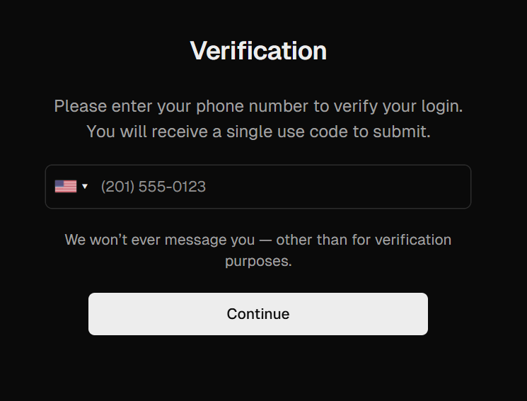
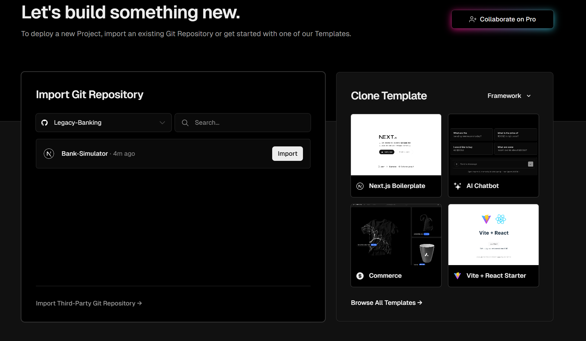
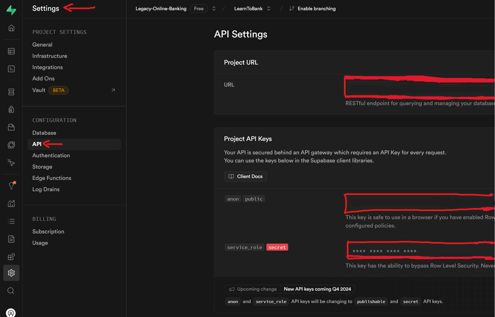
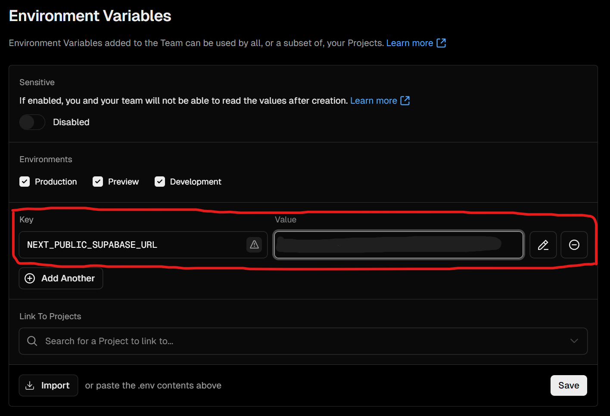
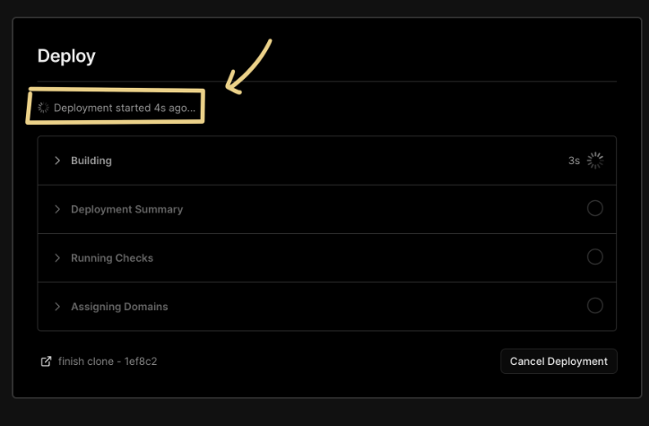
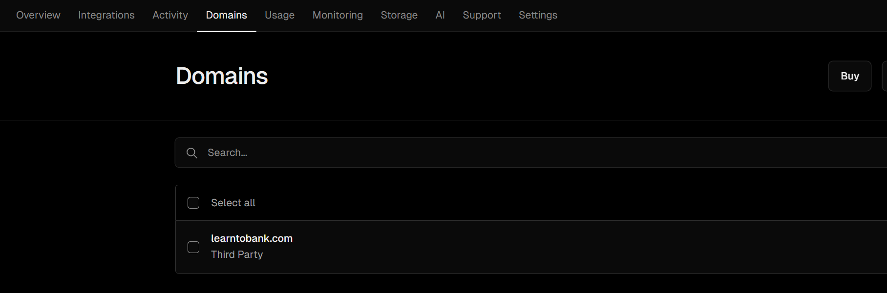

<a href="https://demo-nextjs-with-supabase.vercel.app/">
  
  <h1 align="center"><strong>Bank-Simulator</strong> deployment guide!</h1>
</a>

<p align="center">
 This document will guide you through setting up an account on Vercel, retrieving API keys from Supabase, and deploying the project to make it live.
</p>

<p align="center">
  <a href="#demo"><strong>Demo</strong></a> ·
  <a href="#deploy-to-vercel"><strong>Deploy to Vercel</strong></a> ·
  <a href="#clone-and-run-locally"><strong>Clone and run locally</strong></a> ·
  <a href="#issues"><strong>Issues</strong></a>
</p>
<br/>


## Table of Contents

- **[Getting Started with Vercel](#1-getting-started-with-vercel)**
   - [Step 1: Sign Up for a Vercel Account](#step-1-sign-up-for-a-vercel-account)
   - [Step 2: Connect Vercel to GitHub](#step-2-connect-vercel-to-github)
- **[Retrieving API Keys from Supabase](#2-retrieving-api-keys-from-supabase)**
   - [Step 3: Go to Supabase and Grab API Keys](#step-3-go-to-supabase-and-grab-api-keys)
- **[Setting Environment Variables in Vercel](#3-setting-environment-variables-in-vercel)**
- **[Final Deployment on Vercel](#4-final-deployment-on-vercel)**
- **[Customizing Domain and Additional Settings](#5-customizing-domain-and-additional-settings)**
- **[Additional Resources](#6-additional-resources)**
- **[Clone and Run Locally](#clone-and-run-locally)**
- **[Issues](#issues)**

## Demo

You can view a fully working demo at [learn-to-bank.vercel.app](https://learn-to-bank.vercel.app/).
---
## System Requirements

This project, **Learn to Bank**, is a fake bank simulator designed to help seniors. The application was developed using the following tools and environment configurations. Please follow the setup guides linked for each item to ensure compatibility.

### Operating System
- **[Windows 11](https://www.microsoft.com/software-download/windows11)** (recommended): The project was primarily tested on Windows 11. Other operating systems (e.g., macOS, Linux) may work, but slight differences in setup might arise.

### Development Tools and Dependencies

- **[Node.js](https://nodejs.org/)**: JavaScript runtime environment required for both frontend and backend development.
  - **Recommended Version**: 20.17.0 or above.
  - Ensure that `npm` (Node Package Manager) is also installed with Node.js.

- **[Git](https://git-scm.com/)**: Version control system for collaborative development.
  - **Minimum Version**: 2.x
  - Git is compatible with most versions, so any recent version should work fine.

### Database

- **[Supabase (PostgreSQL)](https://supabase.io)**: Primary database for data storage.
  - Supabase is based on PostgreSQL, providing an SQL interface and real-time features.

### Configuration Files

- **Environment Variables**: Configuration files for environment variables (e.g., `.env` file) should include the following keys:
  - `NEXT_PUBLIC_SUPABASE_URL`: The URL of your Supabase project.
  - `NEXT_PUBLIC_SUPABASE_ANON_KEY`: Public API key for Supabase.
  - `SUPABASE_SERVICE_ROLE_KEY`: (if needed for backend operations).

- **Frontend and Backend Dependencies**:
  - For the versions of plugins, packages, and frameworks used, refer to:
    - `package.json` in the root directory for frontend dependencies.
    - Environment variables are specified in `.env.local` for both frontend and backend configurations.

### Additional Tools

- **[React Developer Tools](https://react.dev/)**: Recommended for inspecting and debugging React components.
- **[Vercel Deployment Setup](https://vercel.com/)**: For deploying the application, use the Vercel CLI or link the GitHub repository to Vercel for automatic deployments.

### Recommended IDE

- **[Visual Studio Code](https://code.visualstudio.com/)** (VS Code) or any modern code editor with support for JavaScript and TypeScript.

## Deploy to Vercel

Vercel deployment will guide you through creating a Supabase account and project.

After installation of the Supabase integration, all relevant environment variables will be assigned to the project so the deployment is fully functioning.

[](https://vercel.com/new/clone?repository-url=https%3A%2F%2Fgithub.com%2Fvercel%2Fnext.js%2Ftree%2Fcanary%2Fexamples%2Fwith-supabase&project-name=nextjs-with-supabase&repository-name=nextjs-with-supabase&demo-title=nextjs-with-supabase&demo-description=This%20starter%20configures%20Supabase%20Auth%20to%20use%20cookies%2C%20making%20the%20user's%20session%20available%20throughout%20the%20entire%20Next.js%20app%20-%20Client%20Components%2C%20Server%20Components%2C%20Route%20Handlers%2C%20Server%20Actions%20and%20Middleware.&demo-url=https%3A%2F%2Fdemo-nextjs-with-supabase.vercel.app%2F&external-id=https%3A%2F%2Fgithub.com%2Fvercel%2Fnext.js%2Ftree%2Fcanary%2Fexamples%2Fwith-supabase&demo-image=https%3A%2F%2Fdemo-nextjs-with-supabase.vercel.app%2Fopengraph-image.png&integration-ids=oac_VqOgBHqhEoFTPzGkPd7L0iH6)

The above will also clone the Starter kit to your GitHub, you can clone that locally and develop locally.

If you wish to just develop locally and not deploy to Vercel, [follow the steps below](#clone-and-run-locally).
## 1. Getting Started with Vercel

### Step 1: Sign Up for a Vercel Account

- **Go to [vercel.com](https://vercel.com/):** Visit the Vercel website.
- **Sign Up for Vercel:**
  - Click on **Sign Up**.
  - Choose **Sign up with GitHub** (recommended).
  - **Verify with Phone Number**: Vercel may require a phone number to complete the account setup. Follow the prompts and enter your phone number for verification.



### Step 2: Connect Vercel to GitHub

- After creating your Vercel account, ensure that Vercel is connected to the GitHub account that holds this **Bank-Simulator** repository.
- In Vercel, go to your **Dashboard** and click **New Project**.
- You should see a list of GitHub repositories. Locate **Bank-Simulator** and select it.



---

## 2. Retrieving API Keys from Supabase

### Step 3: Go to Supabase and Grab API Keys

1. **Visit [Supabase](https://supabase.com/):** Log in with the same credentials as provided.
2. **Locate Your Project:**
   - Go to your Supabase dashboard, and select the project related to Bank-Simulator.
3. **Retrieve API Keys:**
   - Find the following API keys in the Supabase settings:
     - **Supabase URL**
     - **Service Role Key**
     - **Anon Key**
   - Copy each of these keys. You’ll use them in Vercel in the next step.



---

## 3. Setting Environment Variables in Vercel

1. **Go to Project Settings on Vercel:**
   - In your Vercel dashboard, find your **Bank-Simulator** project.
2. **Add Environment Variables:**
   - Go to **Settings > Environment Variables**.
   - For each of the Supabase keys, click **Add New Variable** and enter:
     - `NEXT_SUPABASE_URL` for the Supabase URL.
     - `NEXT_PUBLIC_SERVICE_ROLE_KEY` for the Service Role Key.
     - `NEXT_PUBLIC_SUPABASE_ANON_KEY` for the Anon Key.
   - Paste the respective values you copied from Supabase.



---

## 4. Final Deployment on Vercel

1. **Deploy the Project:**
   - After setting up the environment variables, return to the **Overview** tab in Vercel and click **Deploy**.
   - Wait for Vercel to build and deploy the project. This may take a few minutes.

2. **Access Your Deployed Site:**
   - Once the deployment is complete, click **Visit** to view the live version of **Bank-Simulator**.



---

## 5. Customizing Domain and Additional Settings

- **Change the Domain Name**:
  - If you want a custom domain, go to the **Domains** section in your project settings on Vercel.
  - Follow the prompts to add and configure a custom domain.

- **Additional Project Settings**:
  - Review other settings in Vercel, such as **Privacy Settings** or **Build and Development Settings**, as needed.



---

## 6. Additional Resources

- [Vercel Documentation](https://vercel.com/docs): For additional information on managing deployments.
- [Supabase Documentation](https://supabase.com/docs): Learn more about managing and securing your Supabase project.

---

By following this guide, you should be able to deploy **Bank-Simulator** successfully on Vercel! If you run into any issues, please reach out to your developer for further assistance.


## Clone and run locally
1.
   ```bash
   git clone [url]
   ```

2. Use `cd` to change into the app's directory

   ```bash
   cd Bank-Simulator
   ```

3. Rename `.env.local.example` to `.env.local` and update the following:

   ```
   NEXT_PUBLIC_SUPABASE_URL=[INSERT SUPABASE PROJECT URL]
   NEXT_PUBLIC_SUPABASE_ANON_KEY=[INSERT SUPABASE PROJECT API ANON KEY]
   ```

   Both `NEXT_PUBLIC_SUPABASE_URL` and `NEXT_PUBLIC_SUPABASE_ANON_KEY` can be found in [your Supabase project's API settings](https://app.supabase.com/project/_/settings/api)

4. You can now run the Next.js local development server:

   ```bash
   npm run dev
   ```

   The starter kit should now be running on [localhost:3000](http://localhost:3000/).

> Check out [the docs for Local Development](https://supabase.com/docs/guides/getting-started/local-development) to also run Supabase locally.

## Issues

Describe issues in repository:
1.  ##
2.  ##

